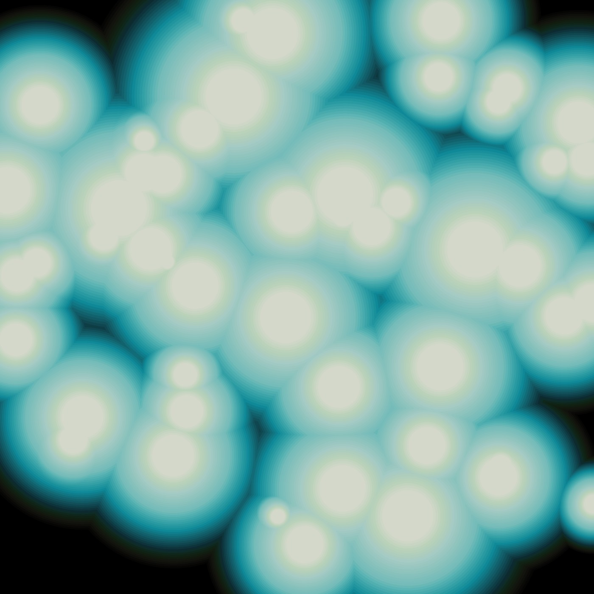

# Oily Blobs

This project, created in Processing, drew inspiration from the mesmerizing metaballs algorithm, which I stumbled upon through The Coding Train youtube channel. The discovery was truly intriguing. This marks my first experience using the PShape object to render shapes on the canvas.

Opting for these shapes instead of the typical ellipse(...) served two primary purposes.
First, it posed a challenge, compelling me to grasp the intricacies of this new object.
Second, these shapes proved swifter in rendering compared to their "normal" counterparts. The framerate remains less affected by the abundance of blobs, allowing me to incorporate more without causing significant lag.
Although the outcome is beautiful, I still find it rather simple. However, I won't give up and will strive for something more dynamic and complex in the near future.

It has been four months since I embarked on this journey, and I am excited about the new creations that may emerge. I hope they will satisfy my hunger for beauty.
